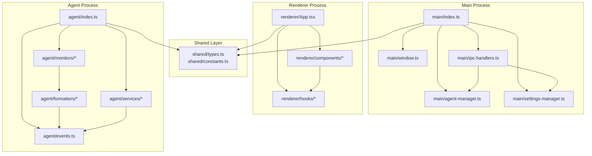

# Technical Design Document: Desktop Activity Tracker
## Complete Implementation Guide for Junior Developers

**Version:** 5.0 (Comprehensive Edition)  
**Author:** Lead Technical Architect  
**Last Updated:** [Current Date]

---

## Table of Contents
1. [Introduction and Goals](#1-introduction-and-goals)
2. [High-Level Architecture](#2-high-level-architecture)
3. [Technology Stack and Justification](#3-technology-stack-and-justification)
4. [Development Prerequisites and Setup](#4-development-prerequisites-and-setup)
5. [Project Structure and Module Organization](#5-project-structure-and-module-organization)
6. [Component Deep-Dive with Implementation Guide](#6-component-deep-dive-with-implementation-guide)
7. [Data Schema and Event Formatting](#7-data-schema-and-event-formatting)
8. [Testing Strategy and Implementation](#8-testing-strategy-and-implementation)
9. [Build and Deployment Process](#9-build-and-deployment-process)
10. [Performance Considerations](#10-performance-considerations)
11. [Security and Privacy](#11-security-and-privacy)
12. [Risks and Mitigation Strategies](#12-risks-and-mitigation-strategies)
13. [Development Roadmap](#13-development-roadmap)
14. [Appendix: Code Templates and Examples](#14-appendix-code-templates-and-examples)

---

## 1. Introduction and Goals

### 1.1. Overview
This document provides a comprehensive technical blueprint for building the Desktop Activity Tracker application. It serves as both an architectural guide and a step-by-step implementation manual, designed specifically for junior developers to understand and build the entire system independently.

### 1.2. Technical Goals
- **Cross-Platform Compatibility**: Build a desktop application that runs seamlessly on Windows, macOS, and Linux using Electron.js
- **Performance Efficiency**: Create a lightweight monitoring agent with minimal CPU and memory footprint (<50MB RAM, <2% CPU)
- **Real-Time Data Streaming**: Establish a robust pipeline streaming events to Apache Kafka with <100ms latency
- **Modular Architecture**: Design components that can be developed, tested, and deployed independentlyx`
- **Developer-Friendly**: Provide clear interfaces, comprehensive error handling, and extensive logging for debugging

### 1.3. Learning Objectives for Junior Developers
By implementing this system, you will learn:
- Building production-grade Electron applications
- Implementing inter-process communication (IPC)
- Working with event-driven architectures
- Integrating with Apache Kafka for data streaming
- Writing comprehensive unit and integration tests
- Managing child processes in Node.js
- Implementing reactive UI with React and TypeScript

---

## 2. High-Level Architecture

### 2.1. System Overview

The Desktop Activity Tracker consists of three primary components working in harmony:

```mermaid
graph TD
    subgraph "User's Machine"
        subgraph "Electron Application"
            A[Renderer Process<br/>React UI<br/>Port: 3000 (dev)]
            B[Main Process<br/>Node.js Core<br/>IPC Handler]
            P[Preload Script<br/>Security Bridge]
        end

        subgraph "Monitoring Agent<br/>(Separate Node.js Process)"
            C[App Monitor<br/>2-3s polling]
            D[FS Monitor<br/>Real-time]
            E[Browser Monitor<br/>Extension Bridge]
            EV[Event Bus<br/>EventEmitter]
            F[Kafka Producer<br/>Stream Buffer]
        end

        subgraph "Local Storage"
            S[SQLite DB<br/>User Settings]
            L[Log Files<br/>Debug Info]
        end
    end

    subgraph "External Infrastructure"
        G[Kafka Broker<br/>Port: 9092]
        H[Kafka UI<br/>Port: 8080]
        Z[Zookeeper<br/>Port: 2181]
    end

    %% UI to Main Process Communication
    A -.->|contextBridge API| P
    P -->|IPC Commands| B
    
    %% Main Process Management
    B -->|fork()| C & D & E
    B -->|Settings| S
    B -->|Debug Logs| L
    
    %% Agent Internal Flow
    C -->|Events| EV
    D -->|Events| EV
    E -->|Events| EV
    EV -->|Batched| F
    
    %% Kafka Flow
    F -->|TCP Stream| G
    G <-->|Coordination| Z
    H -->|Query| G
```

### 2.2. Architectural Flow Description

#### 2.2.1. User Interaction Flow
1. **User Action**: User clicks "Start Monitoring" in the React UI
2. **IPC Communication**: UI sends command through secure preload bridge to Main Process
3. **Process Spawning**: Main Process forks the Monitoring Agent as a child process
4. **Agent Initialization**: Agent starts all monitors and connects to Kafka
5. **Event Detection**: Monitors detect user activity (app switches, file changes)
6. **Event Processing**: Events are formatted and sent to the shared Event Bus
7. **Data Streaming**: Kafka Producer batches and streams events to Kafka Broker
8. **Visualization**: External Kafka UI tools can visualize the real-time data stream

#### 2.2.2. Component Responsibilities

**Electron Main Process**:
- Window management and lifecycle
- Agent process lifecycle (start/stop/restart)
- Settings persistence and retrieval
- System tray integration
- Auto-updater management

**Monitoring Agent**:
- Runs as an isolated process for stability
- Polls for active window changes
- Watches filesystem for modifications
- Communicates with browser extensions
- Buffers and streams events to Kafka

**React UI**:
- Provides user controls (start/stop)
- Displays current monitoring status
- Manages user settings (ignored paths)
- Shows real-time activity preview
- Handles error notifications

---

## 3. Technology Stack and Justification

### 3.1. Core Technologies

| Technology | Version | Purpose | Justification |
|------------|---------|---------|---------------|
| **Electron.js** | 27.x | Desktop framework | Cross-platform, mature ecosystem, native OS integration |
| **TypeScript** | 5.x | Programming language | Type safety, better IDE support, easier refactoring |
| **React** | 18.x | UI framework | Component-based, large community, excellent DevTools |
| **Vite** | 5.x | Build tool | Fast HMR, modern ES modules, optimized production builds |
| **Node.js** | 20.x LTS | Runtime | Required by Electron, stable LTS version |

### 3.2. Monitoring Libraries

| Library | Purpose | Why This Choice |
|---------|---------|-----------------|
| **active-win** | Window detection | Cross-platform, maintained, includes browser URL support |
| **chokidar** | File watching | Solves native fs.watch issues, efficient, battle-tested |
| **node-window-manager** | Fallback window detection | Alternative for when active-win fails |

### 3.3. Data and Communication

| Technology | Purpose | Justification |
|------------|---------|---------------|
| **Apache Kafka** | Event streaming | Reliable, scalable, perfect for time-series data |
| **kafkajs** | Kafka client | Pure JavaScript, no native dependencies, well-documented |
| **better-sqlite3** | Local storage | Synchronous API, faster than alternatives, embedded |

### 3.4. Testing and Quality

| Tool | Purpose | Why This Choice |
|------|---------|-----------------|
| **Vitest** | Unit testing | Fast, native ESM support, Jest-compatible |
| **React Testing Library** | UI testing | Best practices, focuses on user behavior |
| **Playwright** | E2E testing | Electron support, reliable, great debugging |

---

## 4. Development Prerequisites and Setup

### 4.1. System Requirements

**Development Machine**:
- **OS**: Windows 10+, macOS 10.15+, or Ubuntu 20.04+
- **RAM**: Minimum 8GB (16GB recommended)
- **Storage**: 2GB free space
- **Node.js**: v20.x LTS
- **npm**: v10.x or **pnpm**: v8.x (recommended)

### 4.2. Required Software Installation

```bash
# 1. Install Node.js (use nvm for easy version management)
# macOS/Linux:
curl -o- https://raw.githubusercontent.com/nvm-sh/nvm/v0.39.0/install.sh | bash
nvm install 20
nvm use 20

# 2. Install pnpm (faster than npm)
npm install -g pnpm

# 3. Install Docker (for Kafka)
# Follow instructions at https://docs.docker.com/get-docker/

# 4. Install Git
# https://git-scm.com/downloads
```

### 4.3. Kafka Infrastructure Setup

Create `docker-compose.yml` for local Kafka:

```yaml
version: '3.8'
services:
  zookeeper:
    image: confluentinc/cp-zookeeper:7.5.0
    hostname: zookeeper
    container_name: zookeeper
    ports:
      - "2181:2181"
    environment:
      ZOOKEEPER_CLIENT_PORT: 2181
      ZOOKEEPER_TICK_TIME: 2000

  kafka:
    image: confluentinc/cp-kafka:7.5.0
    hostname: kafka
    container_name: kafka
    depends_on:
      - zookeeper
    ports:
      - "9092:9092"
      - "9101:9101"
    environment:
      KAFKA_BROKER_ID: 1
      KAFKA_ZOOKEEPER_CONNECT: 'zookeeper:2181'
      KAFKA_LISTENER_SECURITY_PROTOCOL_MAP: PLAINTEXT:PLAINTEXT,PLAINTEXT_HOST:PLAINTEXT
      KAFKA_ADVERTISED_LISTENERS: PLAINTEXT://kafka:29092,PLAINTEXT_HOST://localhost:9092
      KAFKA_OFFSETS_TOPIC_REPLICATION_FACTOR: 1
      KAFKA_TRANSACTION_STATE_LOG_MIN_ISR: 1
      KAFKA_TRANSACTION_STATE_LOG_REPLICATION_FACTOR: 1
      KAFKA_GROUP_INITIAL_REBALANCE_DELAY_MS: 0
      KAFKA_JMX_PORT: 9101
      KAFKA_JMX_HOSTNAME: localhost

  kafka-ui:
    image: provectuslabs/kafka-ui:latest
    container_name: kafka-ui
    depends_on:
      - kafka
    ports:
      - "8080:8080"
    environment:
      KAFKA_CLUSTERS_0_NAME: local
      KAFKA_CLUSTERS_0_BOOTSTRAPSERVERS: kafka:29092
```

Start Kafka:
```bash
docker-compose up -d
```

---

## 5. Project Structure and Module Organization

### 5.1. Complete Directory Structure

```
desktop-activity-tracker/
├── .github/                      # GitHub Actions CI/CD
│   └── workflows/
│       ├── test.yml             # Run tests on PR
│       └── release.yml          # Build and release
├── src/
│   ├── main/                    # Electron main process
│   │   ├── index.ts            # Entry point
│   │   ├── window.ts           # Window management
│   │   ├── ipc-handlers.ts    # IPC communication
│   │   ├── agent-manager.ts   # Child process management
│   │   ├── settings-manager.ts # User preferences
│   │   └── __tests__/         # Main process tests
│   ├── preload/                # Preload scripts
│   │   └── index.ts           # Security bridge
│   ├── renderer/               # React UI
│   │   ├── main.tsx           # React entry
│   │   ├── App.tsx            # Root component
│   │   ├── components/        # UI components
│   │   │   ├── Dashboard.tsx
│   │   │   ├── Settings.tsx
│   │   │   └── __tests__/
│   │   ├── hooks/             # Custom React hooks
│   │   ├── styles/            # CSS/SCSS files
│   │   └── types/             # TypeScript types
│   ├── agent/                  # Monitoring agent
│   │   ├── index.ts           # Agent entry
│   │   ├── events.ts          # Event bus
│   │   ├── monitors/          # Activity monitors
│   │   │   ├── app-monitor.ts
│   │   │   ├── fs-monitor.ts
│   │   │   └── __tests__/
│   │   ├── formatters/        # Event formatters
│   │   │   ├── app-event-formatter.ts
│   │   │   ├── fs-event-formatter.ts
│   │   │   └── __tests__/
│   │   ├── services/          # External services
│   │   │   ├── kafka-emitter.ts
│   │   │   └── __tests__/
│   │   └── types/             # Agent types
│   ├── shared/                 # Shared code
│   │   ├── constants.ts       # App constants
│   │   ├── types.ts           # Shared types
│   │   └── utils.ts           # Utility functions
│   └── e2e/                    # E2E tests
│       ├── app.spec.ts
│       └── fixtures/
├── public/                     # Static assets
├── scripts/                    # Build scripts
│   ├── notarize.js           # macOS notarization
│   └── build.js              # Custom build logic
├── .env.example               # Environment template
├── .eslintrc.json            # ESLint config
├── .prettierrc               # Prettier config
├── electron-builder.json     # Electron Builder config
├── package.json              # Dependencies
├── tsconfig.json             # TypeScript config
├── vite.config.ts           # Vite config
├── vitest.config.ts         # Vitest config
└── README.md                # Project documentation
```

### 5.2. Module Boundaries and Dependencies



---

## 6. Component Deep-Dive with Implementation Guide

### 6.1. The Monitoring Agent (`src/agent/`)

The monitoring agent is the heart of the application, running as a separate process to ensure stability and isolation.

#### 6.1.1. Agent Entry Point (`src/agent/index.ts`)

**Purpose**: Orchestrate all monitoring components and manage the agent lifecycle.

**Implementation Guide**:

```typescript
// src/agent/index.ts
import { AppMonitor } from './monitors/app-monitor';
import { FileSystemMonitor } from './monitors/fs-monitor';
import { KafkaEmitter } from './services/kafka-emitter';
import { eventBus } from './events';
import { AgentConfig } from '../shared/types';

class MonitoringAgent {
  private appMonitor: AppMonitor;
  private fsMonitor: FileSystemMonitor;
  private kafkaEmitter: KafkaEmitter;
  private isRunning = false;

  constructor() {
    this.appMonitor = new AppMonitor();
    this.fsMonitor = new FileSystemMonitor();
    this.kafkaEmitter = new KafkaEmitter();
    
    this.setupProcessHandlers();
  }

  private setupProcessHandlers(): void {
    // Handle messages from parent process
    process.on('message', async (message: any) => {
      console.log('[Agent] Received message:', message.type);
      
      switch (message.type) {
        case 'start':
          await this.start(message.config);
          break;
        case 'stop':
          await this.stop();
          break;
        case 'updateConfig':
          await this.updateConfig(message.config);
          break;
      }
    });

    // Graceful shutdown handlers
    process.on('SIGTERM', () => this.shutdown());
    process.on('SIGINT', () => this.shutdown());
    
    // Error handling
    process.on('uncaughtException', (error) => {
      console.error('[Agent] Uncaught exception:', error);
      this.shutdown(1);
    });
  }

  private async start(config: AgentConfig): Promise<void> {
    if (this.isRunning) {
      console.warn('[Agent] Already running');
      return;
    }

    try {
      console.log('[Agent] Starting with config:', config);
      
      // Initialize Kafka connection
      await this.kafkaEmitter.connect();
      
      // Subscribe Kafka emitter to event bus
      eventBus.on('activity', (event) => {
        this.kafkaEmitter.sendEvent(event);
      });
      
      // Start monitors
      this.appMonitor.start();
      this.fsMonitor.start(config.watchPaths, config.ignorePaths);
      
      this.isRunning = true;
      
      // Notify parent process
      process.send?.({ type: 'started' });
      
    } catch (error) {
      console.error('[Agent] Failed to start:', error);
      process.send?.({ type: 'error', error: error.message });
      this.shutdown(1);
    }
  }

  private async stop(): Promise<void> {
    if (!this.isRunning) return;
    
    console.log('[Agent] Stopping...');
    
    // Stop monitors
    this.appMonitor.stop();
    this.fsMonitor.stop();
    
    // Disconnect from Kafka
    await this.kafkaEmitter.disconnect();
    
    this.isRunning = false;
    process.send?.({ type: 'stopped' });
  }

  private async updateConfig(config: AgentConfig): Promise<void> {
    console.log('[Agent] Updating config:', config);
    
    // Update filesystem monitor paths
    if (config.watchPaths || config.ignorePaths) {
      this.fsMonitor.updatePaths(config.watchPaths, config.ignorePaths);
    }
    
    process.send?.({ type: 'configUpdated' });
  }

  private async shutdown(exitCode = 0): Promise<void> {
    console.log('[Agent] Shutting down...');
    await this.stop();
    process.exit(exitCode);
  }
}

// Initialize and start the agent
const agent = new MonitoringAgent();
console.log('[Agent] Process started, waiting for commands...');
```

**Key Concepts for Junior Developers**:
- **Process Communication**: Uses Node.js IPC to receive commands from parent
- **Error Boundaries**: Comprehensive error handling prevents crashes
- **Lifecycle Management**: Clear start/stop/shutdown procedures
- **Event-Driven**: Decoupled components communicate via events

#### 6.1.2. Event Bus (`src/agent/events.ts`)

**Purpose**: Central communication hub for all agent components.

```typescript
// src/agent/events.ts
import { EventEmitter } from 'events';
import { ActivityEvent } from '../shared/types';

class TypedEventEmitter extends EventEmitter {
  emit(event: 'activity', data: ActivityEvent): boolean;
  emit(event: string | symbol, ...args: any[]): boolean {
    return super.emit(event, ...args);
  }

  on(event: 'activity', listener: (data: ActivityEvent) => void): this;
  on(event: string | symbol, listener: (...args: any[]) => void): this {
    return super.on(event, listener);
  }
}

// Export singleton instance
export const eventBus = new TypedEventEmitter();

// Set max listeners to prevent warnings
eventBus.setMaxListeners(20);
```

#### 6.1.3. Application Monitor (`src/agent/monitors/app-monitor.ts`)

**Purpose**: Detect active application changes and browser tab switches.

**Implementation with Testing Considerations**:

```typescript
// src/agent/monitors/app-monitor.ts
import activeWin from 'active-win';
import { eventBus } from '../events';
import { formatAppEvent } from '../formatters/app-event-formatter';
import { ActiveWindow } from '../types';

export class AppMonitor {
  private intervalId: NodeJS.Timeout | null = null;
  private lastWindow: ActiveWindow | null = null;
  private pollInterval: number;

  constructor(pollInterval = 2000) {
    this.pollInterval = pollInterval;
  }

  start(): void {
    if (this.intervalId) {
      console.warn('[AppMonitor] Already running');
      return;
    }

    console.log(`[AppMonitor] Starting with ${this.pollInterval}ms interval`);
    
    // Check immediately on start
    this.checkActiveWindow();
    
    // Then poll at interval
    this.intervalId = setInterval(() => {
      this.checkActiveWindow();
    }, this.pollInterval);
  }

  stop(): void {
    if (this.intervalId) {
      clearInterval(this.intervalId);
      this.intervalId = null;
      console.log('[AppMonitor] Stopped');
    }
  }

  private async checkActiveWindow(): Promise<void> {
    try {
      const window = await activeWin();
      
      if (!window) {
        console.debug('[AppMonitor] No active window detected');
        return;
      }

      // Check if window has changed
      if (this.hasWindowChanged(window)) {
        console.log('[AppMonitor] Window changed:', window.title);
        
        const event = formatAppEvent(window);
        eventBus.emit('activity', event);
        
        this.lastWindow = window;
      }
    } catch (error) {
      console.error('[AppMonitor] Error checking active window:', error);
    }
  }

  private hasWindowChanged(window: ActiveWindow): boolean {
    if (!this.lastWindow) return true;
    
    // For browsers, check URL changes too
    if (window.owner?.name.includes('Chrome') || 
        window.owner?.name.includes('Firefox')) {
      return this.lastWindow.url !== window.url;
    }
    
    // For other apps, check window title
    return this.lastWindow.title !== window.title ||
           this.lastWindow.owner?.name !== window.owner?.name;
  }
}
```

**Testing Strategy**:

```typescript
// src/agent/monitors/__tests__/app-monitor.spec.ts
import { describe, it, expect, vi, beforeEach, afterEach } from 'vitest';
import { AppMonitor } from '../app-monitor';
import { eventBus } from '../../events';

vi.mock('active-win');

describe('AppMonitor', () => {
  let monitor: AppMonitor;
  
  beforeEach(() => {
    vi.useFakeTimers();
    monitor = new AppMonitor(1000); // 1s interval for testing
  });
  
  afterEach(() => {
    monitor.stop();
    vi.restoreAllMocks();
  });

  it('should emit event when window changes', async () => {
    const activeWin = await import('active-win');
    const mockWindow = {
      title: 'Test Window',
      owner: { name: 'TestApp', processId: 123 },
      bounds: { x: 0, y: 0, width: 1920, height: 1080 }
    };
    
    vi.mocked(activeWin.default).mockResolvedValue(mockWindow);
    
    const emitSpy = vi.spyOn(eventBus, 'emit');
    
    monitor.start();
    
    // Fast-forward timer
    await vi.advanceTimersByTimeAsync(1000);
    
    expect(emitSpy).toHaveBeenCalledWith('activity', expect.objectContaining({
      eventType: 'APP_ACTIVE',
      payload: expect.objectContaining({
        appName: 'TestApp'
      })
    }));
  });
});
```

#### 6.1.4. File System Monitor (`src/agent/monitors/fs-monitor.ts`)

**Purpose**: Watch specified directories for file changes.

```typescript
// src/agent/monitors/fs-monitor.ts
import chokidar, { FSWatcher } from 'chokidar';
import { eventBus } from '../events';
import { formatFileEvent } from '../formatters/fs-event-formatter';
import path from 'path';

export class FileSystemMonitor {
  private watcher: FSWatcher | null = null;
  private watchPaths: string[] = [];
  private ignorePaths: string[] = [];

  start(watchPaths: string[], ignorePaths: string[] = []): void {
    if (this.watcher) {
      console.warn('[FSMonitor] Already running');
      return;
    }

    this.watchPaths = watchPaths;
    this.ignorePaths = ignorePaths;

    console.log('[FSMonitor] Starting with paths:', watchPaths);
    console.log('[FSMonitor] Ignoring:', ignorePaths);

    // Create watcher with optimized settings
    this.watcher = chokidar.watch(watchPaths, {
      ignored: [
        /(^|[\/\\])\../, // Hidden files
        /node_modules/,
        /\.git/,
        ...ignorePaths
      ],
      persistent: true,
      ignoreInitial: true,
      awaitWriteFinish: {
        stabilityThreshold: 300,
        pollInterval: 100
      },
      depth: 5, // Limit recursion depth
      usePolling: false, // Use native events when possible
      interval: 100,
      binaryInterval: 300
    });

    this.setupEventHandlers();
  }

  stop(): void {
    if (this.watcher) {
      this.watcher.close();
      this.watcher = null;
      console.log('[FSMonitor] Stopped');
    }
  }

  updatePaths(watchPaths?: string[], ignorePaths?: string[]): void {
    if (!this.watcher) return;

    if (watchPaths) {
      // Add new paths
      const newPaths = watchPaths.filter(p => !this.watchPaths.includes(p));
      if (newPaths.length > 0) {
        this.watcher.add(newPaths);
        this.watchPaths = watchPaths;
      }
      
      // Remove old paths
      const removedPaths = this.watchPaths.filter(p => !watchPaths.includes(p));
      if (removedPaths.length > 0) {
        this.watcher.unwatch(removedPaths);
      }
    }

    if (ignorePaths) {
      this.ignorePaths = ignorePaths;
      // Restart watcher with new ignore patterns
      this.stop();
      this.start(this.watchPaths, this.ignorePaths);
    }
  }

  private setupEventHandlers(): void {
    if (!this.watcher) return;

    this.watcher
      .on('add', (filePath) => this.handleFileEvent('CREATED', filePath))
      .on('change', (filePath) => this.handleFileEvent('MODIFIED', filePath))
      .on('unlink', (filePath) => this.handleFileEvent('DELETED', filePath))
      .on('error', (error) => console.error('[FSMonitor] Error:', error))
      .on('ready', () => console.log('[FSMonitor] Initial scan complete'));
  }

  private handleFileEvent(changeType: string, filePath: string): void {
    // Additional filtering
    if (this.shouldIgnoreFile(filePath)) {
      return;
    }

    const event = formatFileEvent(changeType, filePath);
    eventBus.emit('activity', event);
  }

  private shouldIgnoreFile(filePath: string): boolean {
    const basename = path.basename(filePath);
    
    // Ignore common temporary files
    const tempPatterns = [
      /~$/,        // Backup files
      /\.tmp$/,    // Temp files
      /\.swp$/,    // Vim swap files
      /\.DS_Store/ // macOS files
    ];
    
    return tempPatterns.some(pattern => pattern.test(basename));
  }
}
```

#### 6.1.5. Event Formatters

**Purpose**: Transform raw monitor data into standardized event objects.

```typescript
// src/agent/formatters/app-event-formatter.ts
import { v4 as uuidv4 } from 'uuid';
import { ActiveWindow } from '../types';
import { AppActiveEvent, BrowserTabActiveEvent } from '../../shared/types';

export function formatAppEvent(window: ActiveWindow): AppActiveEvent | BrowserTabActiveEvent {
  const baseEvent = {
    eventId: uuidv4(),
    timestamp: new Date().toISOString(),
    userId: process.env.USER_ID || 'default-user'
  };

  // Check if it's a browser
  const browserNames = ['Chrome', 'Firefox', 'Safari', 'Edge'];
  const isBrowser = browserNames.some(name => 
    window.owner?.name.includes(name)
  );

  if (isBrowser && window.url) {
    return {
      ...baseEvent,
      eventType: 'BROWSER_TAB_ACTIVE',
      payload: {
        appName: window.owner.name,
        tabTitle: window.title,
        tabUrl: window.url
      }
    };
  }

  return {
    ...baseEvent,
    eventType: 'APP_ACTIVE',
    payload: {
      appName: window.owner?.name || 'Unknown',
      processId: window.owner?.processId || 0,
      appPath: window.owner?.path || ''
    }
  };
}
```

```typescript
// src/agent/formatters/fs-event-formatter.ts
import { v4 as uuidv4 } from 'uuid';
import path from 'path';
import { FileChangeEvent } from '../../shared/types';

export function formatFileEvent(changeType: string, filePath: string): FileChangeEvent {
  return {
    eventId: uuidv4(),
    timestamp: new Date().toISOString(),
    userId: process.env.USER_ID || 'default-user',
    eventType: 'FILE_CHANGED',
    payload: {
      filePath: path.resolve(filePath), // Always use absolute paths
      changeType: changeType as 'CREATED' | 'MODIFIED' | 'DELETED',
      fileName: path.basename(filePath),
      fileExtension: path.extname(filePath),
      directory: path.dirname(filePath)
    }
  };
}
```

#### 6.1.6. Kafka Emitter Service

**Purpose**: Manage Kafka connection and stream events reliably.

```typescript
// src/agent/services/kafka-emitter.ts
import { Kafka, Producer, ProducerConfig, Message } from 'kafkajs';
import { ActivityEvent } from '../../shared/types';

export class KafkaEmitter {
  private kafka: Kafka;
  private producer: Producer;
  private isConnected = false;
  private messageBuffer: Message[] = [];
  private flushInterval: NodeJS.Timeout | null = null;

  constructor() {
    this.kafka = new Kafka({
      clientId: 'desktop-activity-tracker',
      brokers: [process.env.KAFKA_BROKER || 'localhost:9092'],
      retry: {
        initialRetryTime: 100,
        retries: 8
      }
    });

    this.producer = this.kafka.producer({
      allowAutoTopicCreation: true,
      transactionTimeout: 30000
    });
  }

  async connect(): Promise<void> {
    try {
      await this.producer.connect();
      this.isConnected = true;
      console.log('[KafkaEmitter] Connected to Kafka');
      
      // Start buffer flush interval
      this.startBufferFlush();
      
      // Process any buffered messages
      await this.flushBuffer();
    } catch (error) {
      console.error('[KafkaEmitter] Failed to connect:', error);
      throw error;
    }
  }

  async disconnect(): Promise<void> {
    if (this.flushInterval) {
      clearInterval(this.flushInterval);
      this.flushInterval = null;
    }

    // Flush remaining messages
    await this.flushBuffer();

    if (this.isConnected) {
      await this.producer.disconnect();
      this.isConnected = false;
      console.log('[KafkaEmitter] Disconnected from Kafka');
    }
  }

  async sendEvent(event: ActivityEvent): Promise<void> {
    const message: Message = {
      key: event.userId,
      value: JSON.stringify(event),
      timestamp: Date.now().toString()
    };

    if (this.isConnected) {
      // Add to buffer for batch sending
      this.messageBuffer.push(message);
      
      // Flush if buffer is getting large
      if (this.messageBuffer.length >= 100) {
        await this.flushBuffer();
      }
    } else {
      console.warn('[KafkaEmitter] Not connected, buffering message');
      this.messageBuffer.push(message);
    }
  }

  private startBufferFlush(): void {
    // Flush buffer every 5 seconds
    this.flushInterval = setInterval(async () => {
      if (this.messageBuffer.length > 0) {
        await this.flushBuffer();
      }
    }, 5000);
  }

  private async flushBuffer(): Promise<void> {
    if (this.messageBuffer.length === 0 || !this.isConnected) {
      return;
    }

    const messages = [...this.messageBuffer];
    this.messageBuffer = [];

    try {
      await this.producer.send({
        topic: 'user-activity-events',
        messages,
        compression: 1 // GZIP compression
      });
      
      console.log(`[KafkaEmitter] Sent ${messages.length} events`);
    } catch (error) {
      console.error('[KafkaEmitter] Failed to send messages:', error);
      // Re-add messages to buffer for retry
      this.messageBuffer.unshift(...messages);
    }
  }
}
```

### 6.2. The Electron Application

#### 6.2.1. Main Process Entry (`src/main/index.ts`)

**Purpose**: Initialize Electron app and coordinate all main process activities.

```typescript
// src/main/index.ts
import { app, BrowserWindow, Menu, Tray, nativeImage } from 'electron';
import path from 'path';
import { createWindow } from './window';
import { setupIpcHandlers } from './ipc-handlers';
import { AgentManager } from './agent-manager';
import { SettingsManager } from './settings-manager';
import { isDev } from '../shared/utils';

// Prevent multiple instances
const gotTheLock = app.requestSingleInstanceLock();

if (!gotTheLock) {
  app.quit();
} else {
  // Global references to prevent garbage collection
  let mainWindow: BrowserWindow | null = null;
  let tray: Tray | null = null;
  
  // Initialize managers
  const agentManager = new AgentManager();
  const settingsManager = new SettingsManager();

  // Handle second instance attempt
  app.on('second-instance', () => {
    if (mainWindow) {
      if (mainWindow.isMinimized()) mainWindow.restore();
      mainWindow.focus();
    }
  });

  // App event handlers
  app.whenReady().then(async () => {
    // Load user settings
    await settingsManager.load();
    
    // Create main window
    mainWindow = createWindow();
    
    // Setup IPC handlers
    setupIpcHandlers(agentManager, settingsManager);
    
    // Create system tray
    if (!isDev()) {
      tray = createTray();
    }
    
    // Auto-start agent if enabled
    const settings = settingsManager.getSettings();
    if (settings.autoStart) {
      await agentManager.start(settings);
    }
  });

  app.on('window-all-closed', () => {
    // On macOS, keep app running in background
    if (process.platform !== 'darwin') {
      app.quit();
    }
  });

  app.on('activate', () => {
    // On macOS, re-create window when dock icon is clicked
    if (BrowserWindow.getAllWindows().length === 0) {
      mainWindow = createWindow();
    }
  });

  app.on('before-quit', async () => {
    // Gracefully stop agent
    await agentManager.stop();
  });

  // System tray creation
  function createTray(): Tray {
    const icon = nativeImage.createFromPath(
      path.join(__dirname, '../../assets/tray-icon.png')
    );
    
    const tray = new Tray(icon);
    
    const contextMenu = Menu.buildFromTemplate([
      {
        label: 'Show App',
        click: () => {
          if (mainWindow) {
            mainWindow.show();
          }
        }
      },
      {
        label: 'Start Monitoring',
        click: async () => {
          const settings = settingsManager.getSettings();
          await agentManager.start(settings);
        }
      },
      {
        label: 'Stop Monitoring',
        click: async () => {
          await agentManager.stop();
        }
      },
      { type: 'separator' },
      {
        label: 'Quit',
        click: () => {
          app.quit();
        }
      }
    ]);
    
    tray.setToolTip('Desktop Activity Tracker');
    tray.setContextMenu(contextMenu);
    
    return tray;
  }
}

// Enable live reload for Electron in development
if (isDev()) {
  require('electron-reload')(__dirname, {
    electron: path.join(__dirname, '../../node_modules/.bin/electron'),
    hardResetMethod: 'exit'
  });
}
```

#### 6.2.2. Window Management (`src/main/window.ts`)

```typescript
// src/main/window.ts
import { BrowserWindow, shell } from 'electron';
import path from 'path';
import { isDev } from '../shared/utils';

export function createWindow(): BrowserWindow {
  const window = new BrowserWindow({
    width: 1200,
    height: 800,
    minWidth: 800,
    minHeight: 600,
    title: 'Desktop Activity Tracker',
    icon: path.join(__dirname, '../../assets/icon.png'),
    webPreferences: {
      preload: path.join(__dirname, '../preload/index.js'),
      contextIsolation: true,
      nodeIntegration: false,
      sandbox: true
    },
    show: false, // Don't show until ready
    backgroundColor: '#ffffff',
    titleBarStyle: process.platform === 'darwin' ? 'hiddenInset' : 'default'
  });

  // Load the app
  if (isDev()) {
    window.loadURL('http://localhost:3000');
    window.webContents.openDevTools();
  } else {
    window.loadFile(path.join(__dirname, '../renderer/index.html'));
  }

  // Show window when ready
  window.once('ready-to-show', () => {
    window.show();
  });

  // Open external links in browser
  window.webContents.setWindowOpenHandler(({ url }) => {
    shell.openExternal(url);
    return { action: 'deny' };
  });

  // Prevent navigation away from the app
  window.webContents.on('will-navigate', (event, url) => {
    if (!url.startsWith('http://localhost:3000') && !url.startsWith('file://')) {
      event.preventDefault();
      shell.openExternal(url);
    }
  });

  return window;
}
```

#### 6.2.3. IPC Handlers (`src/main/ipc-handlers.ts`)

```typescript
// src/main/ipc-handlers.ts
import { ipcMain } from 'electron';
import { AgentManager } from './agent-manager';
import { SettingsManager } from './settings-manager';
import { IpcChannels } from '../shared/constants';

export function setupIpcHandlers(
  agentManager: AgentManager,
  settingsManager: SettingsManager
): void {
  // Agent control
  ipcMain.handle(IpcChannels.START_MONITORING, async () => {
    try {
      const settings = settingsManager.getSettings();
      await agentManager.start(settings);
      return { success: true };
    } catch (error) {
      return { success: false, error: error.message };
    }
  });

  ipcMain.handle(IpcChannels.STOP_MONITORING, async () => {
    try {
      await agentManager.stop();
      return { success: true };
    } catch (error) {
      return { success: false, error: error.message };
    }
  });

  ipcMain.handle(IpcChannels.GET_MONITORING_STATUS, () => {
    return {
      isRunning: agentManager.isRunning(),
      stats: agentManager.getStats()
    };
  });

  // Settings management
  ipcMain.handle(IpcChannels.GET_SETTINGS, () => {
    return settingsManager.getSettings();
  });

  ipcMain.handle(IpcChannels.UPDATE_SETTINGS, async (_, newSettings) => {
    try {
      await settingsManager.updateSettings(newSettings);
      
      // If agent is running, update its config
      if (agentManager.isRunning()) {
        await agentManager.updateConfig(newSettings);
      }
      
      return { success: true };
    } catch (error) {
      return { success: false, error: error.message };
    }
  });

  // Real-time status updates
  agentManager.on('statusChange', (status) => {
    // Send to all windows
    BrowserWindow.getAllWindows().forEach(window => {
      window.webContents.send(IpcChannels.MONITORING_STATUS_CHANGED, status);
    });
  });
}
```

#### 6.2.4. Agent Manager (`src/main/agent-manager.ts`)

```typescript
// src/main/agent-manager.ts
import { fork, ChildProcess } from 'child_process';
import path from 'path';
import { EventEmitter } from 'events';
import { AgentConfig } from '../shared/types';

export class AgentManager extends EventEmitter {
  private agentProcess: ChildProcess | null = null;
  private restartAttempts = 0;
  private maxRestartAttempts = 3;
  private stats = {
    startTime: null as Date | null,
    eventsProcessed: 0,
    lastError: null as string | null
  };

  async start(config: AgentConfig): Promise<void> {
    if (this.agentProcess) {
      console.log('[AgentManager] Agent already running');
      return;
    }

    console.log('[AgentManager] Starting agent...');
    
    const agentPath = path.join(__dirname, '../agent/index.js');
    
    this.agentProcess = fork(agentPath, [], {
      env: {
        ...process.env,
        USER_ID: config.userId,
        KAFKA_BROKER: config.kafkaBroker
      },
      silent: false // Show agent logs in console
    });

    this.setupProcessHandlers();
    
    // Send start command
    this.agentProcess.send({ type: 'start', config });
    
    this.stats.startTime = new Date();
    this.emit('statusChange', { isRunning: true });
  }

  async stop(): Promise<void> {
    if (!this.agentProcess) {
      return;
    }

    console.log('[AgentManager] Stopping agent...');
    
    return new Promise((resolve) => {
      if (!this.agentProcess) {
        resolve();
        return;
      }

      // Listen for graceful shutdown
      this.agentProcess.once('exit', () => {
        this.agentProcess = null;
        this.stats.startTime = null;
        this.emit('statusChange', { isRunning: false });
        resolve();
      });

      // Send stop command
      this.agentProcess.send({ type: 'stop' });
      
      // Force kill after timeout
      setTimeout(() => {
        if (this.agentProcess) {
          this.agentProcess.kill();
          this.agentProcess = null;
          resolve();
        }
      }, 5000);
    });
  }

  async updateConfig(config: AgentConfig): Promise<void> {
    if (!this.agentProcess) {
      throw new Error('Agent not running');
    }

    this.agentProcess.send({ type: 'updateConfig', config });
  }

  isRunning(): boolean {
    return this.agentProcess !== null;
  }

  getStats() {
    return {
      ...this.stats,
      uptime: this.stats.startTime 
        ? Date.now() - this.stats.startTime.getTime() 
        : 0
    };
  }

  private setupProcessHandlers(): void {
    if (!this.agentProcess) return;

    this.agentProcess.on('message', (message: any) => {
      console.log('[AgentManager] Message from agent:', message);
      
      switch (message.type) {
        case 'started':
          this.restartAttempts = 0;
          break;
        case 'error':
          this.stats.lastError = message.error;
          break;
        case 'stats':
          this.stats.eventsProcessed = message.eventsProcessed;
          break;
      }
    });

    this.agentProcess.on('error', (error) => {
      console.error('[AgentManager] Agent process error:', error);
      this.stats.lastError = error.message;
    });

    this.agentProcess.on('exit', (code, signal) => {
      console.log(`[AgentManager] Agent exited with code ${code}, signal ${signal}`);
      
      this.agentProcess = null;
      this.emit('statusChange', { isRunning: false });
      
      // Auto-restart on unexpected exit
      if (code !== 0 && this.restartAttempts < this.maxRestartAttempts) {
        this.restartAttempts++;
        console.log(`[AgentManager] Attempting restart (${this.restartAttempts}/${this.maxRestartAttempts})`);
        
        setTimeout(() => {
          const config = this.getLastConfig();
          if (config) {
            this.start(config);
          }
        }, 1000 * this.restartAttempts); // Exponential backoff
      }
    });
  }

  private getLastConfig(): AgentConfig | null {
    // Implementation would retrieve last used config
    return null;
  }
}
```

### 6.3. React UI Components

#### 6.3.1. Main App Component (`src/renderer/App.tsx`)

```typescript
// src/renderer/App.tsx
import React, { useState, useEffect } from 'react';
import { Dashboard } from './components/Dashboard';
import { Settings } from './components/Settings';
import { useMonitoring } from './hooks/useMonitoring';
import { useSettings } from './hooks/useSettings';
import './styles/app.css';

export function App() {
  const [activeTab, setActiveTab] = useState<'dashboard' | 'settings'>('dashboard');
  const monitoring = useMonitoring();
  const settings = useSettings();

  return (
    <div className="app">
      <header className="app-header">
        <h1>Desktop Activity Tracker</h1>
        <nav>
          <button 
            className={activeTab === 'dashboard' ? 'active' : ''}
            onClick={() => setActiveTab('dashboard')}
          >
            Dashboard
          </button>
          <button 
            className={activeTab === 'settings' ? 'active' : ''}
            onClick={() => setActiveTab('settings')}
          >
            Settings
          </button>
        </nav>
      </header>

      <main className="app-content">
        {activeTab === 'dashboard' ? (
          <Dashboard {...monitoring} />
        ) : (
          <Settings {...settings} />
        )}
      </main>

      <footer className="app-footer">
        <span className={`status ${monitoring.isRunning ? 'running' : 'stopped'}`}>
          {monitoring.isRunning ? '● Monitoring Active' : '○ Monitoring Stopped'}
        </span>
      </footer>
    </div>
  );
}
```

#### 6.3.2. Custom Hooks

```typescript
// src/renderer/hooks/useMonitoring.ts
import { useState, useEffect } from 'react';
import { IpcChannels } from '../../shared/constants';

export function useMonitoring() {
  const [isRunning, setIsRunning] = useState(false);
  const [stats, setStats] = useState({
    eventsProcessed: 0,
    uptime: 0,
    lastError: null as string | null
  });

  useEffect(() => {
    // Get initial status
    checkStatus();

    // Listen for status changes
    window.electronAPI.onMonitoringStatusChanged((status) => {
      setIsRunning(status.isRunning);
    });

    // Periodic status updates
    const interval = setInterval(checkStatus, 5000);
    return () => clearInterval(interval);
  }, []);

  async function checkStatus() {
    const status = await window.electronAPI.getMonitoringStatus();
    setIsRunning(status.isRunning);
    setStats(status.stats);
  }

  async function start() {
    const result = await window.electronAPI.startMonitoring();
    if (result.success) {
      setIsRunning(true);
    } else {
      console.error('Failed to start monitoring:', result.error);
    }
  }

  async function stop() {
    const result = await window.electronAPI.stopMonitoring();
    if (result.success) {
      setIsRunning(false);
    } else {
      console.error('Failed to stop monitoring:', result.error);
    }
  }

  return {
    isRunning,
    stats,
    start,
    stop
  };
}
```

---

## 7. Data Schema and Event Formatting

### 7.1. Base Event Schema

All events share a common base structure:

```typescript
// src/shared/types.ts
export interface BaseEvent {
  eventId: string;      // UUID v4
  timestamp: string;    // ISO 8601 format
  userId: string;       // User identifier
  eventType: EventType; // Discriminator
}

export type EventType = 
  | 'APP_ACTIVE' 
  | 'BROWSER_TAB_ACTIVE' 
  | 'FILE_CHANGED';

export interface AppActiveEvent extends BaseEvent {
  eventType: 'APP_ACTIVE';
  payload: {
    appName: string;
    processId: number;
    appPath: string;
    windowTitle?: string;
  };
}

export interface BrowserTabActiveEvent extends BaseEvent {
  eventType: 'BROWSER_TAB_ACTIVE';
  payload: {
    appName: string;
    tabTitle: string;
    tabUrl: string;
    domain?: string;
  };
}

export interface FileChangeEvent extends BaseEvent {
  eventType: 'FILE_CHANGED';
  payload: {
    filePath: string;
    fileName: string;
    fileExtension: string;
    directory: string;
    changeType: 'CREATED' | 'MODIFIED' | 'DELETED';
    fileSize?: number;
  };
}

export type ActivityEvent = 
  | AppActiveEvent 
  | BrowserTabActiveEvent 
  | FileChangeEvent;
```

### 7.2. Kafka Topic Structure

```yaml
Topic: user-activity-events
Partitions: 3
Replication Factor: 1 (dev), 3 (production)
Retention: 7 days
Compression: gzip
```

### 7.3. Example Events

```json
// App Active Event
{
  "eventId": "123e4567-e89b-12d3-a456-426614174000",
  "timestamp": "2024-01-15T10:30:00.000Z",
  "userId": "user-123",
  "eventType": "APP_ACTIVE",
  "payload": {
    "appName": "Visual Studio Code",
    "processId": 12345,
    "appPath": "/Applications/Visual Studio Code.app",
    "windowTitle": "index.ts - desktop-activity-tracker"
  }
}

// Browser Tab Event
{
  "eventId": "987f6543-a21b-34c5-d678-876543210987",
  "timestamp": "2024-01-15T10:30:05.000Z",
  "userId": "user-123",
  "eventType": "BROWSER_TAB_ACTIVE",
  "payload": {
    "appName": "Google Chrome",
    "tabTitle": "GitHub - microsoft/vscode",
    "tabUrl": "https://github.com/microsoft/vscode",
    "domain": "github.com"
  }
}

// File Change Event
{
  "eventId": "456d7890-f12e-45a6-b789-012345678901",
  "timestamp": "2024-01-15T10:30:10.000Z",
  "userId": "user-123",
  "eventType": "FILE_CHANGED",
  "payload": {
    "filePath": "/Users/john/projects/my-app/src/index.js",
    "fileName": "index.js",
    "fileExtension": ".js",
    "directory": "/Users/john/projects/my-app/src",
    "changeType": "MODIFIED",
    "fileSize": 2048
  }
}
```

---

## 8. Testing Strategy and Implementation

### 8.1. Testing Pyramid

```
         /\
        /E2E\        5% - Critical user journeys
       /-----\
      / Integ \      15% - Component integration
     /---------\
    /   Unit    \    80% - Business logic
   /--------------\
```

### 8.2. Unit Testing Setup

```typescript
// vitest.config.ts
import { defineConfig } from 'vitest/config';
import path from 'path';

export default defineConfig({
  test: {
    globals: true,
    environment: 'node',
    coverage: {
      provider: 'v8',
      reporter: ['text', 'html', 'lcov'],
      exclude: [
        'node_modules/',
        'src/**/*.spec.ts',
        'src/**/*.test.ts',
        'src/e2e/**'
      ],
      thresholds: {
        branches: 80,
        functions: 80,
        lines: 80,
        statements: 80
      }
    }
  },
  resolve: {
    alias: {
      '@': path.resolve(__dirname, './src')
    }
  }
});
```

### 8.3. Example Unit Tests

```typescript
// src/agent/formatters/__tests__/app-event-formatter.spec.ts
import { describe, it, expect } from 'vitest';
import { formatAppEvent } from '../app-event-formatter';

describe('AppEventFormatter', () => {
  it('should format regular app event correctly', () => {
    const window = {
      title: 'My Document',
      owner: {
        name: 'TextEdit',
        processId: 1234,
        path: '/Applications/TextEdit.app'
      },
      bounds: { x: 0, y: 0, width: 1920, height: 1080 }
    };

    const event = formatAppEvent(window);

    expect(event).toMatchObject({
      eventType: 'APP_ACTIVE',
      payload: {
        appName: 'TextEdit',
        processId: 1234,
        appPath: '/Applications/TextEdit.app'
      }
    });
    
    expect(event.eventId).toMatch(/^[0-9a-f]{8}-[0-9a-f]{4}-4[0-9a-f]{3}-[89ab][0-9a-f]{3}-[0-9a-f]{12}$/i);
    expect(new Date(event.timestamp)).toBeInstanceOf(Date);
  });

  it('should format browser event with URL', () => {
    const window = {
      title: 'GitHub',
      url: 'https://github.com',
      owner: {
        name: 'Google Chrome',
        processId: 5678
      }
    };

    const event = formatAppEvent(window);

    expect(event.eventType).toBe('BROWSER_TAB_ACTIVE');
    expect(event.payload).toMatchObject({
      appName: 'Google Chrome',
      tabTitle: 'GitHub',
      tabUrl: 'https://github.com'
    });
  });

  it('should handle missing data gracefully', () => {
    const window = {
      title: 'Unknown',
      owner: null
    };

    const event = formatAppEvent(window);

    expect(event.payload.appName).toBe('Unknown');
    expect(event.payload.processId).toBe(0);
    expect(event.payload.appPath).toBe('');
  });
});
```

### 8.4. Integration Testing

```typescript
// src/agent/services/__tests__/kafka-emitter.integration.spec.ts
import { describe, it, expect, beforeAll, afterAll } from 'vitest';
import { KafkaEmitter } from '../kafka-emitter';
import { Kafka } from 'kafkajs';

describe('KafkaEmitter Integration', () => {
  let emitter: KafkaEmitter;
  let consumer: any;

  beforeAll(async () => {
    // Start test Kafka container
    emitter = new KafkaEmitter();
    await emitter.connect();

    // Create test consumer
    const kafka = new Kafka({
      clientId: 'test-consumer',
      brokers: ['localhost:9092']
    });
    consumer = kafka.consumer({ groupId: 'test-group' });
    await consumer.connect();
    await consumer.subscribe({ topic: 'user-activity-events' });
  });

  afterAll(async () => {
    await consumer.disconnect();
    await emitter.disconnect();
  });

  it('should send events to Kafka', async () => {
    const testEvent = {
      eventId: 'test-123',
      timestamp: new Date().toISOString(),
      userId: 'test-user',
      eventType: 'APP_ACTIVE' as const,
      payload: {
        appName: 'Test App',
        processId: 1234,
        appPath: '/test/app'
      }
    };

    await emitter.sendEvent(testEvent);

    // Verify message received
    const messages: any[] = [];
    await consumer.run({
      eachMessage: async ({ message }) => {
        messages.push(JSON.parse(message.value.toString()));
      }
    });

    // Wait for message
    await new Promise(resolve => setTimeout(resolve, 1000));

    expect(messages).toHaveLength(1);
    expect(messages[0]).toMatchObject(testEvent);
  });
});
```

### 8.5. E2E Testing

```typescript
// src/e2e/app.spec.ts
import { test, expect, ElectronApplication, Page } from '@playwright/test';
import { _electron as electron } from 'playwright';
import path from 'path';

let app: ElectronApplication;
let page: Page;

test.beforeAll(async () => {
  app = await electron.launch({
    args: [path.join(__dirname, '../../dist/main/index.js')]
  });
  page = await app.firstWindow();
});

test.afterAll(async () => {
  await app.close();
});

test('should start and stop monitoring', async () => {
  // Check initial state
  await expect(page.locator('.status')).toContainText('Monitoring Stopped');

  // Click start button
  await page.click('button:has-text("Start Monitoring")');

  // Verify started
  await expect(page.locator('.status')).toContainText('Monitoring Active');

  // Click stop button
  await page.click('button:has-text("Stop Monitoring")');

  // Verify stopped
  await expect(page.locator('.status')).toContainText('Monitoring Stopped');
});

test('should add ignored directory', async () => {
  // Navigate to settings
  await page.click('button:has-text("Settings")');

  // Add ignored path
  await page.fill('input[placeholder="Enter directory path"]', '/test/ignore');
  await page.click('button:has-text("Add")');

  // Verify added to list
  await expect(page.locator('.ignored-paths')).toContainText('/test/ignore');
});
```

---

## 9. Build and Deployment Process

### 9.1. Build Configuration

```json
// electron-builder.json
{
  "appId": "com.yourcompany.desktop-activity-tracker",
  "productName": "Desktop Activity Tracker",
  "directories": {
    "output": "release"
  },
  "files": [
    "dist/**/*",
    "assets/**/*",
    "node_modules/**/*",
    "!node_modules/*/{CHANGELOG.md,README.md,README,readme.md,readme}",
    "!node_modules/*/{test,__tests__,tests,powered-test,example,examples}",
    "!node_modules/**/*.d.ts"
  ],
  "mac": {
    "category": "public.app-category.productivity",
    "hardenedRuntime": true,
    "gatekeeperAssess": false,
    "entitlements": "build/entitlements.mac.plist",
    "entitlementsInherit": "build/entitlements.mac.plist",
    "notarize": {
      "teamId": "YOUR_TEAM_ID"
    }
  },
  "win": {
    "target": "nsis",
    "certificateFile": "build/cert.pfx",
    "certificatePassword": "${WINDOWS_CERTIFICATE_PASSWORD}"
  },
  "linux": {
    "target": ["AppImage", "deb"],
    "category": "Utility"
  },
  "nsis": {
    "oneClick": false,
    "allowToChangeInstallationDirectory": true
  }
}
```

### 9.2. Build Scripts

```json
// package.json scripts
{
  "scripts": {
    "dev": "concurrently \"npm run dev:main\" \"npm run dev:renderer\"",
    "dev:main": "tsc -w -p tsconfig.main.json",
    "dev:renderer": "vite",
    "build": "npm run build:main && npm run build:renderer && npm run build:agent",
    "build:main": "tsc -p tsconfig.main.json",
    "build:renderer": "vite build",
    "build:agent": "tsc -p tsconfig.agent.json",
    "test": "vitest",
    "test:coverage": "vitest run --coverage",
    "test:e2e": "playwright test",
    "lint": "eslint src --ext .ts,.tsx",
    "format": "prettier --write \"src/**/*.{ts,tsx,json,css}\"",
    "dist": "npm run build && electron-builder",
    "dist:mac": "npm run build && electron-builder --mac",
    "dist:win": "npm run build && electron-builder --win",
    "dist:linux": "npm run build && electron-builder --linux"
  }
}
```

### 9.3. CI/CD Pipeline

```yaml
# .github/workflows/release.yml
name: Build and Release

on:
  push:
    tags:
      - 'v*'

jobs:
  build:
    strategy:
      matrix:
        os: [macos-latest, windows-latest, ubuntu-latest]
    
    runs-on: ${{ matrix.os }}
    
    steps:
      - uses: actions/checkout@v3
      
      - name: Setup Node.js
        uses: actions/setup-node@v3
        with:
          node-version: '20'
          
      - name: Install dependencies
        run: npm ci
        
      - name: Run tests
        run: npm test
        
      - name: Build application
        run: npm run dist
        env:
          GH_TOKEN: ${{ secrets.GITHUB_TOKEN }}
          
      - name: Upload artifacts
        uses: actions/upload-artifact@v3
        with:
          name: ${{ matrix.os }}-build
          path: release/*
```

---

## 10. Performance Considerations

### 10.1. Memory Management

```typescript
// Implement memory-efficient event buffering
class CircularBuffer<T> {
  private buffer: (T | undefined)[];
  private writeIndex = 0;
  private size = 0;

  constructor(private capacity: number) {
    this.buffer = new Array(capacity);
  }

  push(item: T): void {
    this.buffer[this.writeIndex] = item;
    this.writeIndex = (this.writeIndex + 1) % this.capacity;
    if (this.size < this.capacity) this.size++;
  }

  getAll(): T[] {
    const result: T[] = [];
    const start = this.size < this.capacity ? 0 : this.writeIndex;
    
    for (let i = 0; i < this.size; i++) {
      const index = (start + i) % this.capacity;
      const item = this.buffer[index];
      if (item !== undefined) result.push(item);
    }
    
    return result;
  }

  clear(): void {
    this.buffer = new Array(this.capacity);
    this.writeIndex = 0;
    this.size = 0;
  }
}
```

### 10.2. CPU Optimization

- Use debouncing for filesystem events
- Implement adaptive polling intervals
- Batch Kafka messages
- Use worker threads for heavy processing

### 10.3. Performance Monitoring

```typescript
// Add performance metrics collection
class PerformanceMonitor {
  private metrics = {
    eventProcessingTime: [] as number[],
    memoryUsage: [] as number[],
    cpuUsage: [] as number[]
  };

  recordEventProcessing(startTime: number): void {
    const duration = Date.now() - startTime;
    this.metrics.eventProcessingTime.push(duration);
    
    // Keep only last 1000 measurements
    if (this.metrics.eventProcessingTime.length > 1000) {
      this.metrics.eventProcessingTime.shift();
    }
  }

  getAverageProcessingTime(): number {
    const times = this.metrics.eventProcessingTime;
    return times.reduce((a, b) => a + b, 0) / times.length;
  }

  collectSystemMetrics(): void {
    this.metrics.memoryUsage.push(process.memoryUsage().heapUsed);
    // CPU usage collection would go here
  }
}
```

---

## 11. Security and Privacy

### 11.1. Security Measures

1. **Process Isolation**: Agent runs in separate process with limited privileges
2. **IPC Security**: Use contextBridge for secure renderer-main communication
3. **Input Validation**: Validate all user inputs and IPC messages
4. **Secure Storage**: Encrypt sensitive settings using Electron safeStorage

### 11.2. Privacy Protection

```typescript
// Implement privacy filters
class PrivacyFilter {
  private sensitivePatterns = [
    /password/i,
    /secret/i,
    /token/i,
    /\.env$/,
    /\.pem$/,
    /\.key$/
  ];

  shouldFilterPath(filePath: string): boolean {
    return this.sensitivePatterns.some(pattern => 
      pattern.test(filePath)
    );
  }

  sanitizeUrl(url: string): string {
    try {
      const parsed = new URL(url);
      // Remove query parameters that might contain sensitive data
      parsed.search = '';
      // Remove user info
      parsed.username = '';
      parsed.password = '';
      return parsed.toString();
    } catch {
      return 'invalid-url';
    }
  }
}
```

### 11.3. Data Retention

- Implement automatic data cleanup after configurable period
- Allow users to export and delete their data
- No data leaves the machine without explicit consent

---

## 12. Risks and Mitigation Strategies

### 12.1. Technical Risks

| Risk | Impact | Likelihood | Mitigation |
|------|--------|------------|------------|
| **OS Permission Denial** | High | Medium | Implement permission check flow with user guidance |
| **High CPU Usage** | Medium | Low | Adaptive polling, efficient algorithms |
| **Memory Leaks** | High | Medium | Proper cleanup, memory monitoring |
| **Kafka Connection Loss** | Medium | Medium | Buffering, retry logic, offline mode |
| **Browser Detection Failure** | Low | High | Graceful degradation, fallback to app-only tracking |

### 12.2. Implementation Strategy

```typescript
// Example: Permission checking with user guidance
async function checkPermissions(): Promise<boolean> {
  if (process.platform === 'darwin') {
    const { systemPreferences } = require('electron');
    
    const accessibilityAccess = systemPreferences.isTrustedAccessibilityClient(true);
    const screenRecordingAccess = systemPreferences.getMediaAccessStatus('screen') === 'granted';
    
    if (!accessibilityAccess || !screenRecordingAccess) {
      // Show dialog with instructions
      dialog.showMessageBox({
        type: 'warning',
        title: 'Permissions Required',
        message: 'This app needs Accessibility and Screen Recording permissions.',
        detail: 'Please grant permissions in System Preferences > Security & Privacy',
        buttons: ['Open System Preferences', 'Cancel']
      }).then(result => {
        if (result.response === 0) {
          shell.openExternal('x-apple.systempreferences:com.apple.preference.security?Privacy_Accessibility');
        }
      });
      return false;
    }
    return true;
  }
  
  // Windows and Linux typically don't need special permissions
  return true;
}
```

---

## 13. Development Roadmap

### 13.1. Phase 1: Foundation (Weeks 1-2)
- [x] Project setup and configuration
- [x] Basic Electron app with UI skeleton
- [x] Simple start/stop functionality
- [x] Unit test infrastructure

### 13.2. Phase 2: Core Monitoring (Weeks 3-4)
- [x] Active window detection
- [x] File system monitoring
- [x] Event formatting and schema
- [x] Basic Kafka integration

### 13.3. Phase 3: UI and Settings (Weeks 5-6) ✅ COMPLETED
- [x] Complete React UI
- [x] Settings management
- [x] Real-time status display
- [x] Error handling and notifications

### 13.4. Phase 4: Testing and Polish (Weeks 7-8)
- [ ] Comprehensive test coverage
- [ ] Performance optimization
- [ ] Security hardening
- [ ] Documentation

### 13.5. Phase 5: Deployment (Week 9)
- [ ] Build automation
- [ ] Code signing setup
- [ ] Distribution preparation
- [ ] Beta testing

---

## 14. Appendix: Code Templates and Examples

### 14.1. TypeScript Configuration Files

```typescript
// tsconfig.json
{
  "compilerOptions": {
    "target": "ES2022",
    "module": "commonjs",
    "lib": ["ES2022", "DOM"],
    "jsx": "react-jsx",
    "outDir": "./dist",
    "rootDir": "./src",
    "strict": true,
    "esModuleInterop": true,
    "skipLibCheck": true,
    "forceConsistentCasingInFileNames": true,
    "resolveJsonModule": true,
    "moduleResolution": "node",
    "allowSyntheticDefaultImports": true,
    "declaration": true,
    "declarationMap": true,
    "sourceMap": true,
    "incremental": true,
    "tsBuildInfoFile": ".tsbuildinfo"
  },
  "include": ["src/**/*"],
  "exclude": ["node_modules", "dist", "src/**/*.spec.ts", "src/**/*.test.ts"]
}
```

### 14.2. Common Utilities

```typescript
// src/shared/utils.ts
export function isDev(): boolean {
  return process.env.NODE_ENV === 'development';
}

export function debounce<T extends (...args: any[]) => any>(
  func: T,
  wait: number
): (...args: Parameters<T>) => void {
  let timeout: NodeJS.Timeout;
  
  return (...args: Parameters<T>) => {
    clearTimeout(timeout);
    timeout = setTimeout(() => func(...args), wait);
  };
}

export function throttle<T extends (...args: any[]) => any>(
  func: T,
  limit: number
): (...args: Parameters<T>) => void {
  let inThrottle: boolean;
  
  return (...args: Parameters<T>) => {
    if (!inThrottle) {
      func(...args);
      inThrottle = true;
      setTimeout(() => inThrottle = false, limit);
    }
  };
}

export function formatBytes(bytes: number): string {
  const sizes = ['Bytes', 'KB', 'MB', 'GB'];
  if (bytes === 0) return '0 Bytes';
  const i = Math.floor(Math.log(bytes) / Math.log(1024));
  return Math.round(bytes / Math.pow(1024, i) * 100) / 100 + ' ' + sizes[i];
}

export function formatDuration(ms: number): string {
  const seconds = Math.floor(ms / 1000);
  const minutes = Math.floor(seconds / 60);
  const hours = Math.floor(minutes / 60);
  
  if (hours > 0) {
    return `${hours}h ${minutes % 60}m`;
  } else if (minutes > 0) {
    return `${minutes}m ${seconds % 60}s`;
  } else {
    return `${seconds}s`;
  }
}
```

### 14.3. Error Handling Patterns

```typescript
// src/shared/errors.ts
export class AppError extends Error {
  constructor(
    message: string,
    public code: string,
    public statusCode?: number
  ) {
    super(message);
    this.name = 'AppError';
  }
}

export class ValidationError extends AppError {
  constructor(message: string) {
    super(message, 'VALIDATION_ERROR', 400);
  }
}

export class PermissionError extends AppError {
  constructor(message: string) {
    super(message, 'PERMISSION_ERROR', 403);
  }
}

export function isAppError(error: unknown): error is AppError {
  return error instanceof AppError;
}

// Usage
try {
  if (!hasPermission) {
    throw new PermissionError('Screen recording permission required');
  }
} catch (error) {
  if (isAppError(error)) {
    console.error(`[${error.code}] ${error.message}`);
  }
}
```

---

## Conclusion

This comprehensive Technical Design Document provides a complete roadmap for building the Desktop Activity Tracker. By following this guide, a junior developer should be able to:

1. Understand the overall architecture and component relationships
2. Set up the development environment correctly
3. Implement each component with clear guidance
4. Write comprehensive tests for reliability
5. Build and deploy the application successfully

Remember: Start small, test frequently, and iterate. Don't try to implement everything at once. Focus on getting a minimal working version first, then add features incrementally.

Good luck with your implementation! 🚀